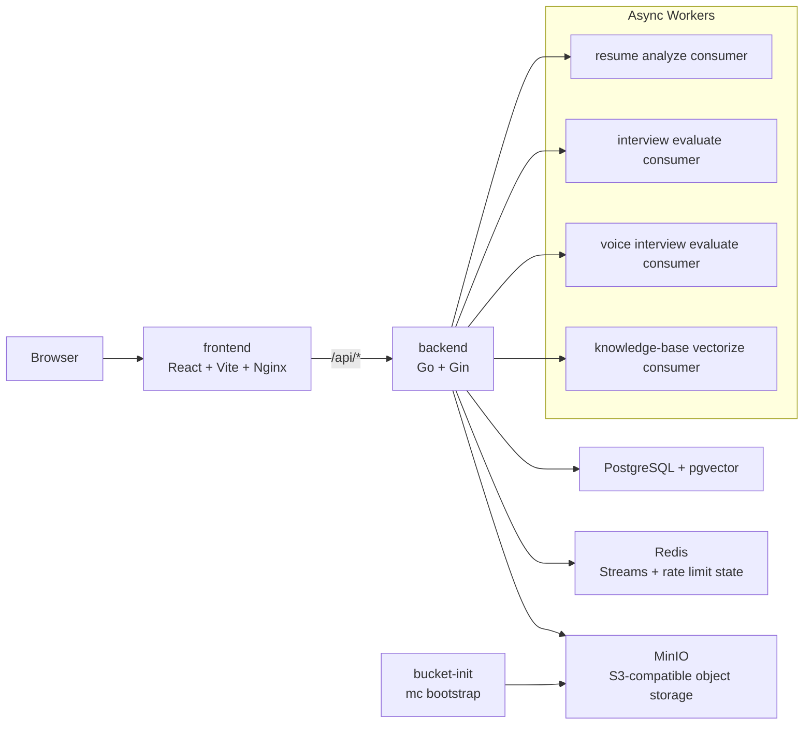

# Architecture

## Overview

goGetJob is a modular interview practice system built around a Go backend and a React frontend. The backend handles resume analysis, text mock interviews, interview scheduling, knowledge-base management, RAG search, real-time voice interview orchestration, async processing, and shared infrastructure. The frontend provides the UI for all modules.

## Runtime Topology

## Backend Layers

### `cmd/server`

This is the composition root. It loads config, creates shared infrastructure, wires module services, and starts the Gin engine. It also launches the Redis Stream consumers and the schedule updater loop.

### `internal/app`

This package owns HTTP middleware, health checks, and route registration. It keeps the Gin engine setup small and centralizes cross-cutting middleware such as CORS and recovery.

### `internal/common`

Shared concerns live here:
- `config` loads YAML plus environment overrides
- `ai` handles prompt loading and provider selection
- `evaluation` wraps report generation
- `middleware` provides CORS and Redis-backed rate limiting
- `response` standardizes JSON output

### `internal/infrastructure`

Infrastructure adapters live here:
- `db` opens PostgreSQL / GORM connections
- `redis` provides the Redis client and Lua-backed rate limit script
- `storage` wraps MinIO / S3-compatible object storage
- `vector` implements the pgvector-backed store and in-memory fallback
- `export` generates PDF outputs
- `file` contains shared file parsing and validation helpers

### `internal/modules`

Feature modules are split by business area:
- `resume`: upload, analysis, history, reanalysis, export
- `interview`: text mock interviews, report generation, async evaluation
- `interviewschedule`: JD parsing and scheduled interview management
- `knowledgebase`: document management, RAG query, and RAG chat
- `voiceinterview`: voice session REST APIs, WebSocket flow, ASR/TTS integration, and async evaluation
- `interview/skill`: filesystem-backed skill catalog and category reference loading

## Data Flow

### Resume Analysis

1. The user uploads a resume.
2. The backend stores the file in MinIO.
3. The backend publishes an async analysis job to Redis Streams.
4. The resume analyze consumer parses the file, runs AI analysis, and persists the result.
5. The history API reads the persisted analysis and the original file metadata.

### Text Interview

1. The user creates a session from a resume and skill profile.
2. The backend builds questions from the skill catalog and prompt templates.
3. Answers are collected through the HTTP API.
4. Completion pushes an evaluation job to Redis Streams.
5. The evaluation service builds the final report and score summary.

### Knowledge Base And RAG

1. The user uploads a document.
2. The backend stores the file in MinIO and persists metadata.
3. The vectorization job is queued in Redis Streams.
4. The worker chunks the content, generates embeddings, and writes vectors into PostgreSQL via pgvector.
5. Query endpoints run rewrite + retrieval + answer generation against that index.

## Operational Notes

- PostgreSQL must have `vector` enabled. The compose setup installs it through `docker/postgres/init.sql`.
- Redis is used for both queue-like background jobs and request rate limiting.
- MinIO is the canonical object store in the Docker setup, but the storage adapter is S3-compatible.
- The backend can fall back to in-memory repositories if `DATABASE_DSN` is empty, but that mode is mainly for local development and tests.
- Voice interview is implemented as a backend module with `/api/voice-interview/*` and `/ws/voice-interview/:sessionId` routes.
- Voice evaluation is processed asynchronously through Redis Streams (`voice-interview:evaluate:stream`) and persisted to session records.
